APSTA-GE 2011 Project 2
================
Kaushik Mohan

Introduction
------------

In this project, I look at clustering careers from the National Longitudinal Survey of Youth (NLSY), which is a representative sample of non-institutionalised men and women in the U.S. between the ages of 14 and 21 in 1979. This cohort was interviewed every year from 1979-1994, and then once every two years until 2000. For this analysis, we take a restricted subset with sequence of quarterly jobs spanning ages 20 to 36 using the NLSY data. A career is defined as the sequence of industries and occupations. For this analysis, 25 unique industry codes and 20 unique occupation codes are combined to form 450 unique IxO pairs. After excluding cases where this data is missing for more than two consecutive panels, we are left with data for 7712 individuals over 64 quarters. For this project, I redo the analysis presented in *Order or Chaos? Understanding career mobility using sequence analysis and information-theoretic models,(2016), Marc Scott and Matthew Zeidenberg*. For this porject, I introduce a network-based approach to estimate distances between sequences and compare the outcomes of the clustering between the two methods. I also take a step towards better visualization of these clusters in the network of IxOs.

------------------------------------------------------------------------

Methodology Overview
--------------------

Typically when performing a clustering exercise, we make use of the feature set for the individual records. In a case such as this where have individual career sequences, we don't readily have a set of features. hence, we take a different approach where we try and model a distance measure between these individuals based on their careers and use the distance/dissimilarity matrix for clustering. The most popular and accepted methodology in literature *(Abbott (1990))* for computing distances between sequences is to use the *Optimal String-Matching Algorithm (OMA)*. OMA dictates that the distance between two sequences, say, *A-A-B-C-B* and *B-B-C-D* can be estimated by looking at the number of insertions, deletions and substitutions to match the two string sequences. Several methodologies have been studied to model the costs of insertion, deletion and substitution to estimate the distances. In the above example, the two strings can be matched by substituting the first *B* with *A* and *D* with *B* and inserting an *A* at the beginning. By modeling costs for the *B* to *A* and *D* to *B* substitution and cost of inserting an *A*, we can estimate the distance between these two sequences.

------------------------------------------------------------------------

Data
----

We load the data and structure it as a sequence using the *TraMineR* package for sequence analysis in R. Here is a look at a sample of the recoded sequences.

    ##   Sequence                                                                                                                                                                                                                           
    ## 1 27-27-27-27-27-27-27-27-27-27-27-27-27-27-27-27-27-140-140-140-140-27-27-27-27-140-140-140-140-140-140-140-140-140-140-140-140-140-140-27-27-27-140-140-140-140-140-27-27-27-140-140-140-140-140-140-3-3-3-3-3-3-3-3               
    ## 2 19-19-3-3-3-3-3-3-3-3-3-3-3-10-10-3-3-3-3-3-3-4-14-14-4-3-3-3-61-3-3-4-4-12-94-94-3-3-3-3-4-3-4-198-198-198-198-32-3-3-3-3-3-3-3-3-3-3-3-3-3-3-4-4                                                                                 
    ## 3 3-3-3-3-3-3-3-1-3-1-3-1-3-1-35-35-35-35-35-35-4-35-35-35-35-35-35-35-3-4-4-3-4-3-3-3-10-10-10-10-10-10-10-35-35-35-35-35-35-35-35-35-35-35-35-35-35-35-39-39-39-3-39-39                                                            
    ## 4 152-5-71-1-1-1-71-36-36-5-4-5-5-4-4-252-252-261-261-261-261-271-271-271-271-228-228-228-228-128-128-128-128-128-128-128-128-128-316-316-316-316-91-91-91-91-271-271-271-271-136-136-136-118-118-118-118-118-118-110-110-110-110-110
    ## 5 3-3-3-3-9-3-3-8-2-8-5-5-8-239-239-239-8-8-8-8-303-303-303-303-303-5-5-5-5-4-4-4-8-87-87-9-2-5-3-3-25-25-10-10-10-10-10-10-10-10-10-10-10-10-10-10-10-10-10-10-10-10-19-19                                                          
    ## 6 22-93-93-93-93-60-60-60-60-126-126-126-126-127-127-127-127-127-59-59-59-59-59-32-32-32-32-32-32-32-32-112-112-112-112-112-112-112-112-4-4-4-22-22-22-22-22-22-22-22-22-22-22-22-22-22-22-22-22-22-22-22-22-22

### Mobility Groups

Based on the approach presented in the *Scott and Zeidenberg* paper, we divide the data into 3 groups based on individual Mobility. The three grups are defined as

-   Stuck: wages are low at age 24 and are still low at age 38
-   Mobile: wages are low at age 24 but are no longer low at age 38
-   Never low: wages are never low, at either age

We now look at the overall distribution of the states over time by mobility group

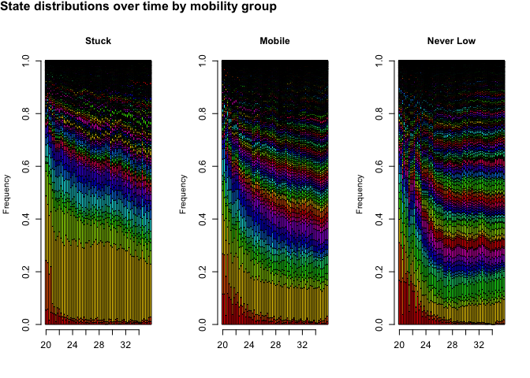

------------------------------------------------------------------------

Substitution Cost Matrix
------------------------

In this section, I detail the two different methods used to estimate the substitution costs. First is the Transition Rate (TRATE) based measure which can be defined as follows:

*S**C*(*i*, *j*)=2 − *P*(*i*|*j*)−*P*(*j*|*i*)

where *P*(*i*|*j*) is the probability of transition from state *j* to *i*.

The second method is to use the network characteristics in the data to estimate this quantity. The hypothesis here is that the substitution costs between two similar jobs (IxOs) should be low. 2 IxOs are similar if they are followed after the same jobs and they lead to the same jobs. For example: If we have two jobs *X* and *Y*, and the transition rates from *A* and *B* to *X* and *Y* are similar and the transition rates from *X* and *Y* to jobs *C* and *D* are similar and these are the only transitions/sequences featuring, *X* and *Y*, we can say that *X* and *Y* are similar. This can be easier understood by visualising the IxOs and their transitions as a network.

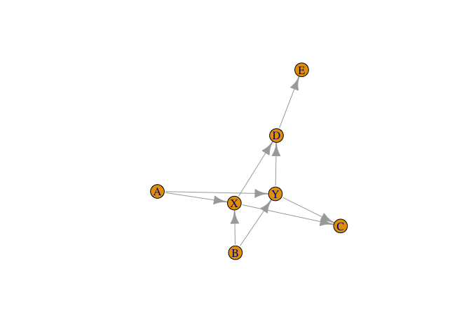

We can use a structural equivalence measure to estimate the distances between two nodes/tokens in the network. This calculates an Euclidean distance measure taking into account the common neighbors between two nodes. The computed distance measure for the sample network is given below. We can see that, the distance between *X* & *Y* is 0 due to their similarity in their position in the network. Simialrly, *A* and *B* are within 0 distance but *C* and *D* have some positive distance due to *E* being an additional neighbor of *D* which *C* does not share.

    ##      A    X    C    B    D    Y    E
    ## A 0.00 1.92 1.74 0.00 1.84 1.92 1.62
    ## X 1.92 0.00 1.92 1.92 2.00 0.00 1.84
    ## C 1.74 1.92 0.00 1.74 1.23 1.92 1.62
    ## B 0.00 1.92 1.74 0.00 1.84 1.92 1.62
    ## D 1.84 2.00 1.23 1.84 0.00 2.00 1.74
    ## Y 1.92 0.00 1.92 1.92 2.00 0.00 1.84
    ## E 1.62 1.84 1.62 1.62 1.74 1.84 0.00

------------------------------------------------------------------------

Network Model
-------------

Based on the approach detailed above, we create a network of IxOs where each node is a IxO token and the edges represent the transition probabilities from one node to the other. Essentially, we are building a network of IxOs based on the transition probability matrix.

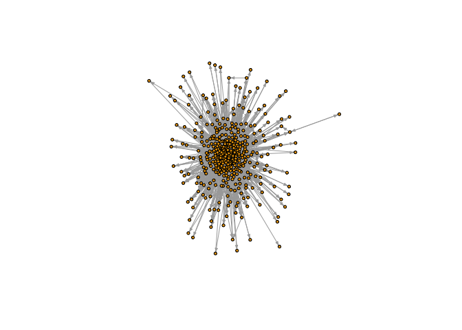

Although, this is not too clear given the number of different IxOs, we can sort of see that there are group of IxOs which are central and interconnected and then there are ones which are on the periphery and connected only to a few other nodes. These are jobs/IxO tokens which are perhaps seen less commonly in sequences and only alongside certain other tokens.

Given this network, we estimate the substitution costs between nodes and compare the results against the Transition Rate based measure. We note that the distribution of these two costs are quite different. The TRATE based measure estimates most costs to be close to 2, meaning, the 1-step probabilities between most two IxOs are close to 0. On the other hand though, the network based measure has a more spread-out distribution peaking around 1.20. In literature, the indel (Insertion and Deletion) costs are typically set at 1 or the substitution costs are at most twice as much as the indel costs. For further analysis, I choose to keep indel costs fixed to analyse the sensitivity of the clustering to just the substitution cost matrix. Keeping in mind the network-based approach, I considered looking at a network based measure such as connectivity or centralization of the network pre and post deletion of a node to estimate these indel costs. For the time being, I reserve that approach for future work.

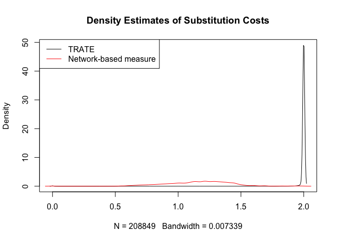

------------------------------------------------------------------------

Clustering
----------

One we have the substitution cost matrices and setting indel costs to 1, we can find distances between sequences using the *Optimal Matching Algorithm* in the *TraMineR* package. We then use this distance matrix to cluster sequences. For this we use the Partition about Medoids (PAM) algorithm which is shown in the *Scott and Zeidenberg* study to be optimal. We next seek to find the optimal number of clusters for the two cases of TRATE and Network-based approaches.

#### Calinski-Harabasz Index

We look at the *C*(*g*) measure for number of clusters ranging from 2 to 64. From these plots, we find the optimal number of clusters to be 4,5 and 2 for the Stuck, mobile and Never Low Mobility groups respectively under the TRATE based distance matrix. For the Network-based distance matrix, we find 2 clusters to be optimal for all three mobility groups.While it might be optimal based on this measure, such few clusters are not likely to give us much information about the groups. We hence look at the Avg. Silhouette widths for the different number of clusters as well.

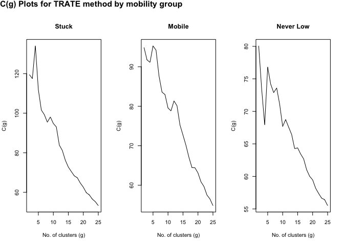

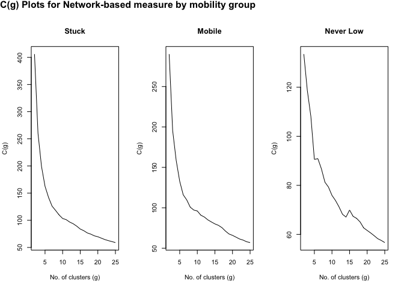

#### Average Silhouette Width

We look at the plot of Avg. Silhouette Width for number of clusters ranging from 2 to 25. The plots below give us a different view and optimal number of clusters compared to the *C*(*g*) plots above. We find 11, 13 and 20 to be the optimal number of clusters for each of the mobility groups from the TRATE based approach. And 10, 13 and 25 to be the optimal number of clusters for each mobility group based on the Network-based approach. While the optimal number of clusters for the Never Low group is unclear as the plot seems to be on an increasing trajectory.

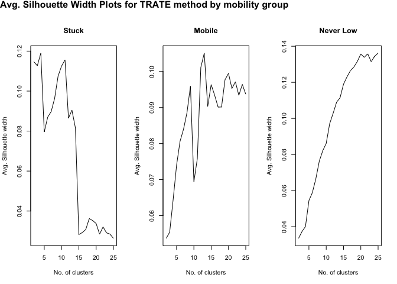

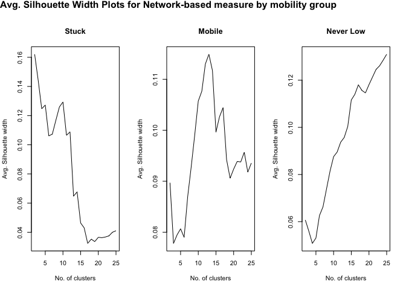

### Comparision

For ease of comparision of the two methods, we stick to the same number of clusters in both the cases and compare the clusters formed. We choose 11, 13 and 20 clusters for Stuck, Mobile and Never Low mobility groups respectively. First, we look at the cluster sizes

    ##    TRATE Network
    ## 1    743     724
    ## 2    211     181
    ## 3    547     419
    ## 4     67     178
    ## 5     87      72
    ## 6    288     181
    ## 7    131     143
    ## 8    106     137
    ## 9     97     143
    ## 10   161     114
    ## 11    46     192
    ##    TRATE Network
    ## 1    159     174
    ## 2    477     538
    ## 3    447     295
    ## 4    178     289
    ## 5    114     135
    ## 6    143     159
    ## 7    120     137
    ## 8    227     202
    ## 9    229     143
    ## 10   163     158
    ## 11   179     116
    ## 12   144     182
    ## 13    90     142
    ##    TRATE Network
    ## 1    287     280
    ## 2     51     182
    ## 3    179     152
    ## 4     50      70
    ## 5    140     167
    ## 6    203     141
    ## 7    234     214
    ## 8    128      85
    ## 9    112     131
    ## 10   141     105
    ## 11   220     173
    ## 12   138     137
    ## 13   119      59
    ## 14   103      94
    ## 15   102     121
    ## 16    63      91
    ## 17    68     139
    ## 18    78      70
    ## 19    85      83
    ## 20    57      64

We note that, in the Stuck mobility group, we have 2 large clusters with ~500-700 observations in them and the rest are smaller groups with ~50-200 observations in them. For the Mobile group, we have one large cluster, the two approaches differ in the sizes of clusters. TRATE based approach has two clusters with ~450-500 observations and the rest have ~100-200 observations. In the Networks case though, we have one large 500 observation cluster and 2 smaller clusters with ~300 observations each. The rest being ~100-200 observation clusters. For the Never Low mobility group, we find somewhat similar distribution between the two methods with a couple of clusters 200-300 observations in size and the rest a lot smaller. Obviously with larger number of clusters compared to the other two mobility groups, we expect this. From the *C*(*g*) and Avg. silhouette width plots, we know that the optimal number of clusters isn't clear for this group. This might be due to the fact that we have many different paths taken by individuals who earn high wages and hence it is difficult to cluster them together.

#### xtabs

Below, are the cross-tabs for the clustering from trate and network approach for mobility groups. Due the to the larger number of clusters, it's not easy to see the number of mismatches. The label-switching in this case isn't straightfoward because of the large number of permutations for each case. We hence need to look for a different way to quantify the matches between the two approaches.

    ##            network.stuck
    ## trate.stuck   1   2   3   4   5   6   7   8   9  10  11
    ##          1  638   0  35  23   0  23   2  10   0  11   1
    ##          2   11 158   5  18   2  12   1   0   1   3   0
    ##          3   39   9 343  49   3  40   6  18   8  16  16
    ##          4    0   1   0   0  54   8   2   1   0   1   0
    ##          5    0   0   2  66   2  14   1   0   0   2   0
    ##          6   34   8   9  14  10  53 125   7   9  11   8
    ##          7    0   3  24   8   0  26   4   4  32  15  15
    ##          8    0   1   1   0   1   3   1  97   1   1   0
    ##          9    1   0   0   0   0   0   1   0  91   3   1
    ##          10   0   1   0   0   0   2   0   0   1   6 151
    ##          11   1   0   0   0   0   0   0   0   0  45   0

    ##             network.mobile
    ## trate.mobile   1   2   3   4   5   6   7   8   9  10  11  12  13
    ##           1  153   1   1   0   0   0   0   1   1   0   0   2   0
    ##           2    7 131 123  16  20  12  14  17   5  22  10  96   4
    ##           3    4 392  17   3   0   3   3   0   5   1   7  12   0
    ##           4    0   0   3 162   0   0   1   3   1   2   0   6   0
    ##           5    1   0   4   0 103   0   0   1   1   0   1   3   0
    ##           6    0   0   8   1   1 131   0   0   0   0   0   1   1
    ##           7    0   0   5   1   2   0 109   0   0   0   3   0   0
    ##           8    3   7  32  97   4   5   5  23  16   6   1  25   3
    ##           9    1   4  77   0   1   0   1   0   1   0   3   7 134
    ##           10   5   2  18   2   3   8   1   1 109   1   4   9   0
    ##           11   0   1   5   5   0   0   1 154   1   0   0  12   0
    ##           12   0   0   2   2   1   0   0   2   3 126   0   8   0
    ##           13   0   0   0   0   0   0   2   0   0   0  87   1   0

    ##               network.neverlow
    ## trate.neverlow   1   2   3   4   5   6   7   8   9  10  11  12  13  14  15
    ##             1   33  11   3   7   5   1   5   5   9   3 166   3   1   1   4
    ##             2   23  15   0   0   2   3   0   0   3   0   2   1   0   0   0
    ##             3   14 128   3   0   1   0   0   1  17   0   1   0   1   3   0
    ##             4    1   1   0  48   0   0   0   0   0   0   0   0   0   0   0
    ##             5    4   1   0   0 128   0   1   0   2   1   1   0   0   0   0
    ##             6   11   4   0   0   1 128   0   0   1   1   0   1   0   0   0
    ##             7    5   0   1   5   0   0 203   0   0   4   1   0   0   0   1
    ##             8   14   3   2   2   6   0   1   8  79   0   0   1   1   0   4
    ##             9    9   2  34   0   3   2   0   1   2   0   0   1  54   2   0
    ##             10   5   2   0   2   0   1   1   0   0   1   0 125   1   0   0
    ##             11   0   0   0   1   3   0   1   0   0  91   0   0   0   0   0
    ##             12  29   8   1   0   2   0   0   3   1   0   1   0   1  88   1
    ##             13   2   0   0   0   0   0   1   0   2   1   0   0   0   0 108
    ##             14   0   1 101   0   0   0   1   0   0   0   0   0   0   0   0
    ##             15  24   1   2   0   1   2   0  63   4   0   0   1   0   0   0
    ##             16   1   0   1   0   0   0   0   0   0   0   0   0   0   0   0
    ##             17  42   2   1   1  11   2   0   1   1   0   1   3   0   0   1
    ##             18  12   0   1   2   2   0   0   1   3   0   0   0   0   0   0
    ##             19   7   2   2   0   1   0   0   2   7   1   0   0   0   0   0
    ##             20  44   1   0   2   1   2   0   0   0   2   0   1   0   0   2
    ##               network.neverlow
    ## trate.neverlow  16  17  18  19  20
    ##             1    8   5   2  14   1
    ##             2    2   0   0   0   0
    ##             3   10   0   0   0   0
    ##             4    0   0   0   0   0
    ##             5    1   1   0   0   0
    ##             6   55   1   0   0   0
    ##             7    0   6   2   6   0
    ##             8    6   1   0   0   0
    ##             9    1   0   1   0   0
    ##             10   1   0   1   1   0
    ##             11   0 123   0   1   0
    ##             12   3   0   0   0   0
    ##             13   0   1   1   3   0
    ##             14   0   0   0   0   0
    ##             15   1   0   1   1   1
    ##             16   0   0  61   0   0
    ##             17   1   1   0   0   0
    ##             18   2   0   0  55   0
    ##             19   0   0   1   0  62
    ##             20   0   0   0   2   0

#### Rand Index

Given the large number of clusters, label-switching and using xtabs to compare is difficult. A simpler measure is to use the Rand Index and compare the % of agreements for the two cases of clustering. From this, we find that there is ~89% agreement between the clusters for the Stuck mobility group and ~91% and ~95% agreement in the clustering for the Mobile and Never Low mobility groups respectively. This perhaps means that, the clustering isn't as sensitive to the substitution costs particularly for the Never Low mobility group.

    ##            Stuck Mobile Never Low
    ## Rand Index  0.89   0.91      0.95

------------------------------------------------------------------------

Visualization
-------------

A mjor challenge in clustering sequences is the inability for us to effectively visualize the solution. When dealing with feature sets or even time-series of quantifiable data, we can project the clusters in the feature/PCA space for a visual check. In this case, though we are limited by the fact that there is no feature set. One approach is to use Multi-Dimensional Scaling to place the observations in a space such that the distances between observations are maintained to the best of ability. These methods typically aim to reduce the stress between observations when fitting into an *n* − *d**i**m**e**n**s**i**o**n**a**l* Euclidean space. As we looked at the IxO network based on transitions, another approach I have experimented with is to visualize the clusters by colouring nodes and respective edges in the IxO network. The hope is that this gives us some sense of medoid paths in the IxO network.

### MDS

When we perform an MDS on two different distance matrices, we would get two different solutions which are hard to compare. Below, I have 4 plots for the output from MDS. First, we have the observations in MDS space from the TRATE-based distance matrix and Network-based distance matrix. Then, we rotate the Network-based output to correspond to the MDS space obtained from the TRATE-based based measure. Lastly, to try and compare the clusters, I have coloured the observations based on the network based clustering but plotted the points based on the TRATE-based MDS. Give the label-switching issues, this is an attempt to try and see if where the mismatches in the clusters are in this space. I'm not sure of the validity of this last approach though.

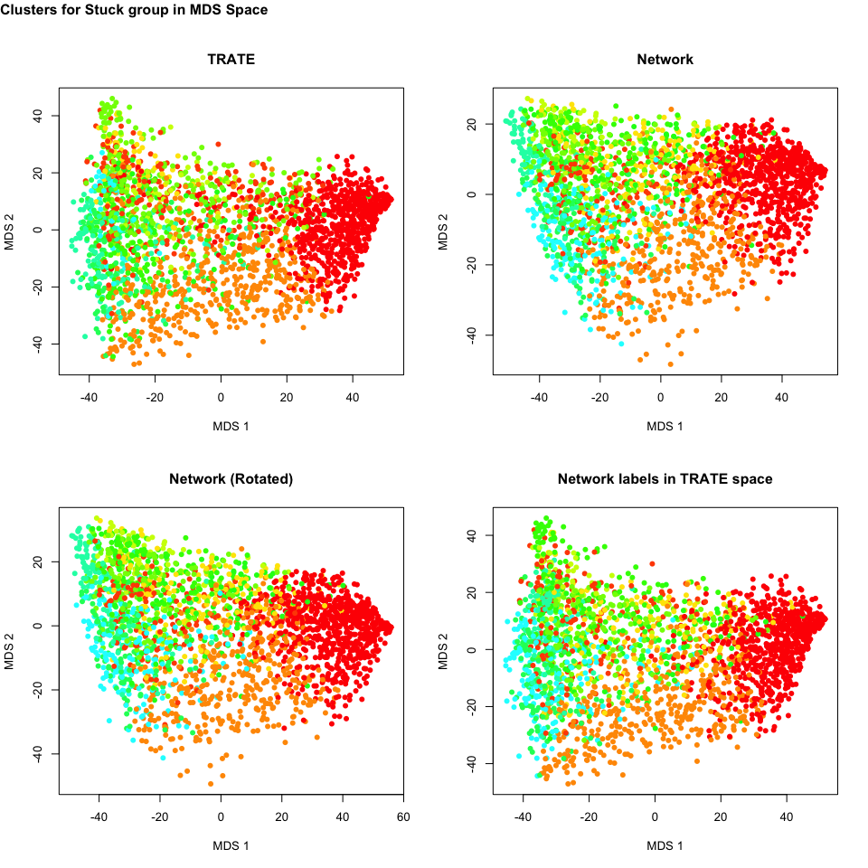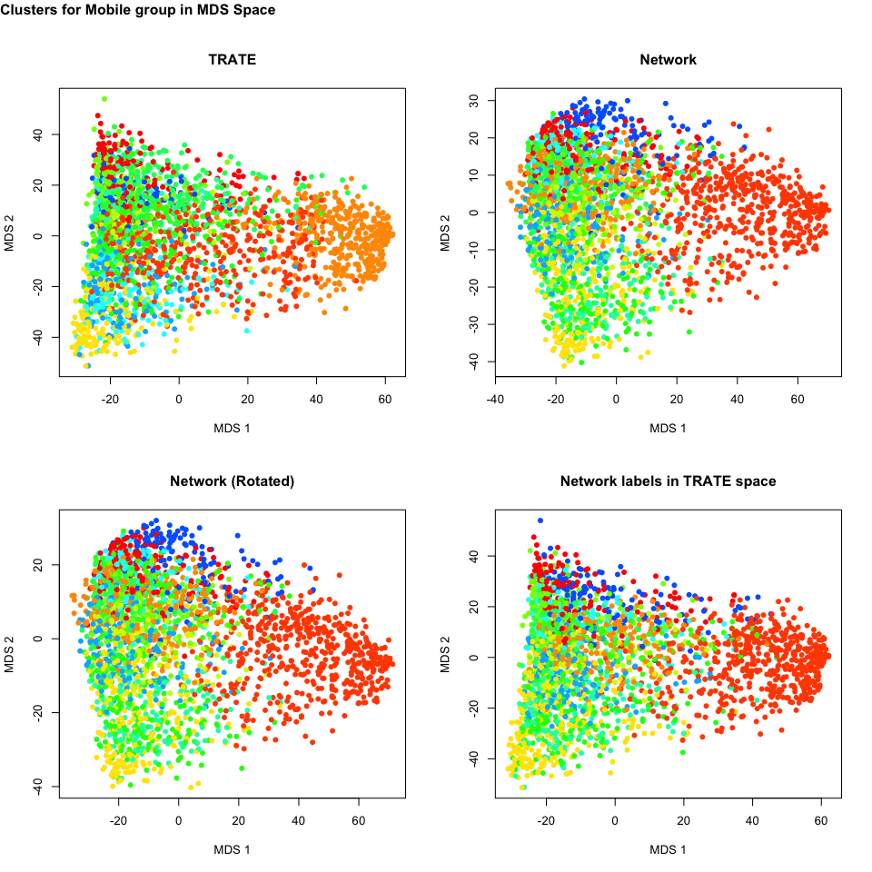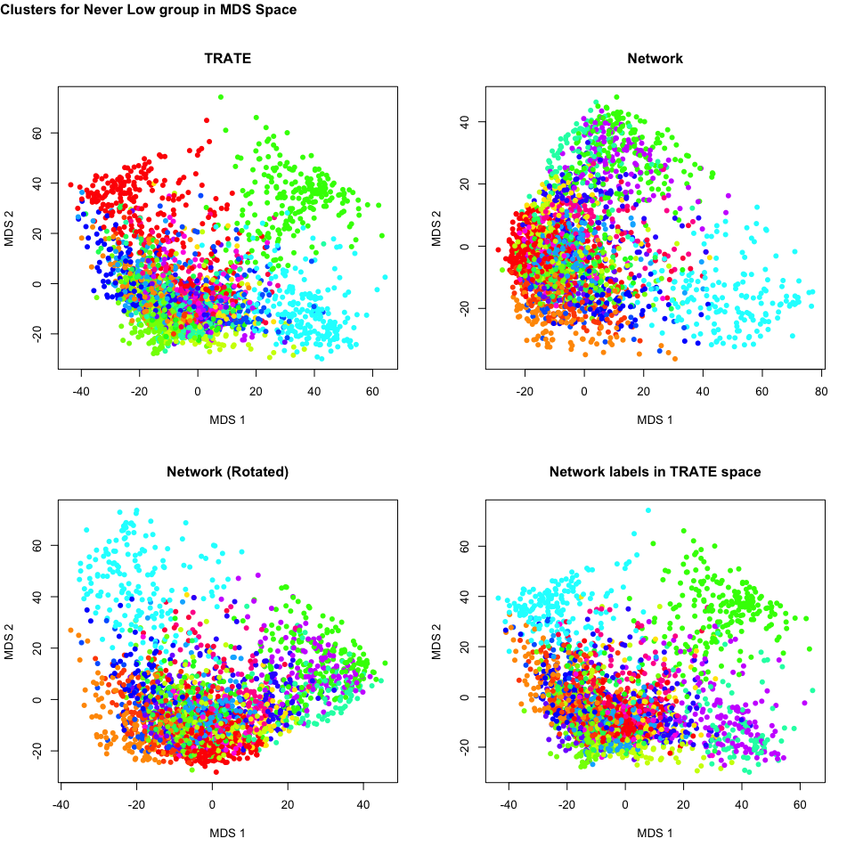

Based on these plots, we find that larger clusters do indeed match up. Something that was verified by the RandIndex measure as well. But clearly, 2-dimensions isn't enough to identify the clusters as the observations all look clumped together in these dimensions. It is hard to know how many dimesnsions is right and for sequence data such as this, it is hard to put a name on these dimensions as well.

### IxO Network

Below, we look at visualizing the medoid sequences within the IxO network. We first take a subgraph of the full IxO network consisting of just the nodes present across all the medoid sequences for the respective mobility group. As a sample, only the largest clusters with maximal overlap across the two methods within each mobility group are presented below.

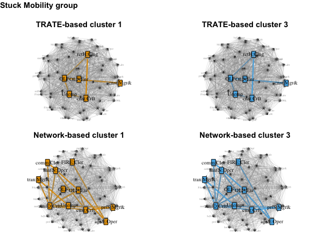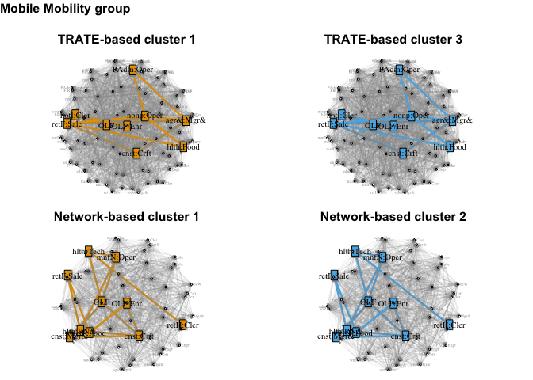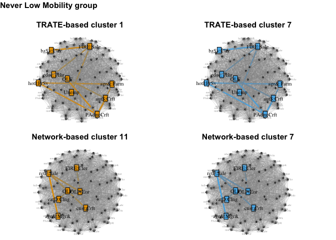

------------------------------------------------------------------------

Conclusion
----------

In conclusion, we note that although the distribution of substitution costs were quite different to begin with, the final output from the clustering does match up to a good extent. This is due to the fact that the larger clusters which are the most similar observations match to a good extent as visible roughly from the MDS plots. Observing the medoid sequences might give us some more insights into what differentiates these clusters and how the medoids themselves differ across the two methods. We also note that some of the medoid observations do match up across the two methodologies consistent with the rest of the comparisions.

Having said this, looking at the medoids themselves, not all of them make complete sense. For example, cluster 2 in the Stuck mobility groups look similar based on the plots above but it is one that involves a job across many different industries and occupations. It includes *Education:Teacher* as one of the tokens and also *Manufacturing:Operations, Clerical* etc. This seems a bit strange that a career that goes across seemingly unrrelated domains is a medoid. Perhaps, because of this nature of the sequence, the cost of substitutions to match other sequences might be lower making it a medoid. The first cluster in this mobility group which is by far the largest makes some sense. Firstly, it captures fewer IxOs including *OLF* and *Unemployment* and involves *Manufacturing*, *Construction*, and *Sales* roles apart from these. It can be imagined that these are individuals who spend a large part of their careers unemployed or out of the labour force or spending long periods of time in one of these lowe-wage positions.

For the Mobile mobility group, the larger clusters are as numbered 3 and 2 in the network plots, show signs of significant movement across jobs. The tokens in these medoid sequence are similar and capture roles in several domains such as *Education*, *Manufacturing*, *Retail*, *Wholesale*, *Food*, etc. The paths across the two methods also look fairly similar with *Healthcare* and *Construction* being the different tokens in the Network-based medoid.

The results for the Never Low group are odd at first sight. Even though these are the clusters with maximal overlap, the medoid sequences look very different. Cluster 7 in particular seems to have many different tokens in the TRATE based measure while having just *Manufacturing:Sales* apart from OLFs in the Network based measure. A reason for this is perhaps because the network measure has lower substitution costs, the distances between sequences which have tokens similar to *Manufacturing:Sales* are estimated lower hence putting them in the same cluster. Overall, these results are clearly not painting the complete picture. It is positive to see similarities to the traditional approach but it is not very clear as to which is better. Further improvements to this methodology would include making better use of the multi-channel nature of these sequences. Perhaps the network based measure for similarity would make more sense when comparing Occupations and Industries separately. Further improvements could also be made to the network-visualization by clustering the nodes themselves, first.
